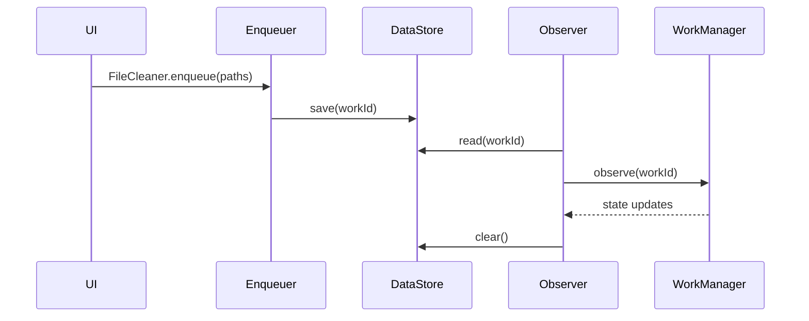

# File Cleaner Lifecycle

This document explains how file-cleaning requests move through Smart Cleaner's work pipeline and how UI components observe the resulting work.

## Pipeline Overview
1. **`FileCleaner.enqueue`** – UI helper that prevents duplicate jobs, shows standard feedback and delegates to the work enqueuer.
2. **`FileCleanWorkEnqueuer.enqueue`** – Chunks file paths, enqueues `FileCleanupWorker` instances and persists the `WorkRequest` ID.
3. **`FileCleanupWorker.doWork`** – Iterates over each file, updates the progress notification and dispatches success or failure events.
4. **`CleaningManager.deleteFiles`** – Coordinates deletion or trash moves.
5. **`DeleteFilesUseCase`** – Executes the actual delete or move-to-trash operation on the repository.

## Result Structure and Observer Utility
* `FileCleanupWorker` returns a `Result` whose `outputData` may contain `KEY_FAILED_PATHS`, an array of file paths that could not be processed. Callers can read it via `info.outputData.getStringArray(FileCleanupWorker.KEY_FAILED_PATHS)` to surface partial failures.
* The `observeFileCleanWork` helper cancels any previous observer, attaches to the stored work ID, and triggers callbacks for running, success, failure, or cancellation while clearing the ID when finished.

## Work ID Persistence

## Notification Updates
* Worker shows a determinate progress notification (`n/N files cleaned`).
* After each file, progress is updated.
* On completion the notification is replaced with success, partial, or failure text and is dismissed after a short delay.

## `CleaningEventBus` Callbacks
* `FileCleanupWorker` publishes `notifyCleaned(success: Boolean)` when work ends.
* Subscribers (e.g., streak trackers or ViewModels) collect `CleaningEventBus.events` to refresh UI or statistics.

## Further Reading
* [Cleanup Job System](cleanup_jobs.md)
* Feature docs such as [Empty Folder Cleaner](empty_folder_cleaner.md) and [Trash Recovery](trash_recovery.md)
